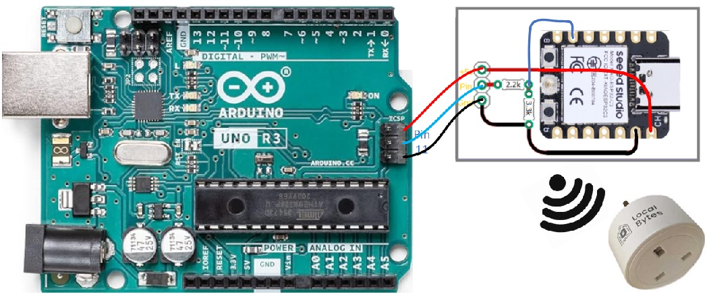

# Arduino controlled middleware for Tasmota smartplugs

## Overview

This project enables an Arduino sketch to control mains power through wireless conectivity with open source smartplugs using Tasmota protocol. The software in this repository is middleware running on an ESP32  that communicates with the controlling Arduino and one or more Tasmota smart plugs. Each plug can be associated with an arduino pin that when set HIGH turns the plug on, and off when LOW.


In the example above, Arduino pin 11 turns the plug on when HIGH, off when LOW. 

## Functional Overview

The middleware transforms the ESP32 into an access point, facilitating connections from Tasmota smart plugs. The SSID follows the pattern `plugAPxxxx`, utilizing the last four digits of the ESP32's MAC address. Upon becoming an access point, the middleware accepts connections from Tasmota smart plugs and responds to changes in Arduino pin states by sending appropriate HTTP commands to control the smart plugs' power.

### Pairing Middleware with Smart Plugs

New plugs (or plugs reset to modify configuration) must be paired using the Tasmota setup procedure, connecting them to the `plugAPxxxx` SSID broadcasted by the ESP32 middleware.

## Development Environment Setup

### Cloning the Repository

Clone the repository to your local machine using:

```
git clone https://github.com/michaelmargolis/TasmotaMiddleware
```

### Opening in PlatformIO

Open the cloned project in PlatformIO, available as a VS Code extension. This environment supports extensive library management and compatibility with various development boards.

## Configuring the Middleware

### Editing `config.json`

The `data` directory contains `config.json`, a template for your smart plug configuration. Customize it with the MAC addresses of your smart plugs and the corresponding control pins on the ESP32. Note these pin numbers refer to the ESP32, you can connect the Arduino pin of your choice to this pin. IMPORTANT - the ESP32 is not 5v tolerant, use voltage level tranlation with 5 volt Arduinos. Note that SPI control mode is not supported in this version.

```json
{
  "SPI_controlMode": false,
  "esp_pin_map": [10,9,8],
  "plug_ip": [13,12],
  "plug_mac4": ["EA2D", "E946"]
}
```

### Uploading `config.json` to ESP32

Use PlatformIO's "Upload File System Image" task to upload your configuration file to the ESP32. This step is crucial for the middleware to recognize and control your smart plugs.


## Pairing Middleware with Smart Plugs

### New Plugs

1. **Initial Connection**: Connect a computer or smartphone to the `tasmota-xxxx` SSID provided by the smart plug upon powering up.
2. **Activate Controller Access Point**: Power up the ESP32 controller to broadcast the `plugAPxxxx` SSID.
3. **Select Controller SSID**: Ensure visibility of the intended controller's SSID and connect to it.
4. **Configure Wi-Fi Credentials on the Plug**:
    - Navigate to `http://192.168.4.1` using a web browser.
    - In the Tasmota interface, set the SSID to `plugAPxxxx` and the password to `passxxxx`, corresponding to the controller's MAC address.
    - Ensure correctness of the case-sensitive SSID and password.
    - Save and allow the plug to restart and connect to the controller's SSID.
    - Note the IP address assigned by the DHCP server, this will be changed to a static IP address in the next step. 
5. **Configure the plug's IP address**:
    - Switch the computer's Wi-Fi to the controller's SSID ('PlugAPxxxx').
    - Access the plug's homepage (`http://192.168.4.2` or as indicated) and navigate to the Information section to note the last four digits of the plug's MAC address.
    - Click the Console button on the home page and enter the following commands:
      - type: IPAddress1 1.192.168.4.xxx (where xxx is the ip octet identifying this plug, this octet value and the MAC digits will be entered into the config.json)
      - type: restart 1 (this will apply the change and restart the plug)
      - navigate your browswer to the new ip address to verify the change
6. **Label the plug**
    - Mark the plug with the plug's MAC suffix and the last IP octet as well as the controller's SSID for easy identification.


## Usage

See Using the Tasmota gateway [here](hardware/Tasmota Gateway Getting Started.pdf)

## Contributing

Contributions are welcome. Please fork the repository, make your changes, and submit a pull request.

## License

This project is licensed under the MIT License - see the [LICENSE](LICENSE) file for details.
